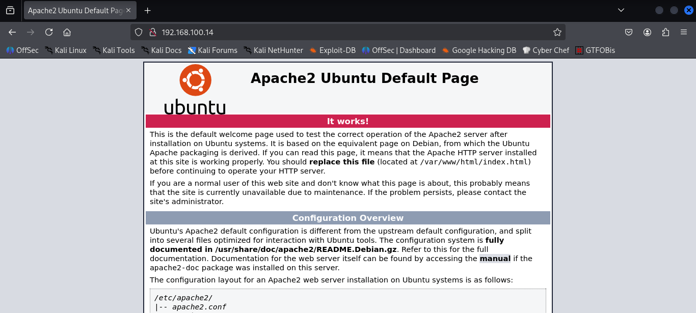

# Minu V1 Write Up

### Getting the Ip address of the target machine I used arp-scan in local network

> target ip: 192.168.100.14

### Target Scanning using nmap

```bash
┌──(kali㉿kali)-[~]
└─$ nmap -sV 192.168.100.14                           
Starting Nmap 7.95 ( https://nmap.org ) at 2025-09-20 03:10 EDT
Nmap scan report for 192.168.100.14
Host is up (0.0025s latency).
Not shown: 999 closed tcp ports (reset)
PORT   STATE SERVICE VERSION
80/tcp open  http    Apache httpd 2.4.27
MAC Address: 08:00:27:E8:55:D7 (PCS Systemtechnik/Oracle VirtualBox virtual NIC)
Service Info: Host: 127.0.1.1

Service detection performed. Please report any incorrect results at https://nmap.org/submit/ .
Nmap done: 1 IP address (1 host up) scanned in 8.10 seconds

```

Only http port (80) is open, lets open it in web browser and got the following page


Using the nikto tool to get the vulnearabilities

```bash

┌──(kali㉿kali)-[~/Desktop/Machines_WriteUps/Minu_v1]
└─$ nikto -h http://192.168.100.14/           
- Nikto v2.5.0
---------------------------------------------------------------------------
+ Target IP:          192.168.100.14
+ Target Hostname:    192.168.100.14
+ Target Port:        80
+ Start Time:         2025-09-20 11:11:15 (GMT-4)
---------------------------------------------------------------------------
+ Server: Apache/2.4.27 (Ubuntu)
+ No CGI Directories found (use '-C all' to force check all possible dirs)
+ /: Server may leak inodes via ETags, header found with file /, inode: 2aa6, size: 56a9aee1bb80f, mtime: gzip. See: http://cve.mitre.org/cgi-bin/cvename.cgi?name=CVE-2003-1418
+ Apache/2.4.27 appears to be outdated (current is at least Apache/2.4.54). Apache 2.2.34 is the EOL for the 2.x branch.
+ OPTIONS: Allowed HTTP Methods: POST, OPTIONS, HEAD, GET .
+ /icons/README: Apache default file found. See: https://www.vntweb.co.uk/apache-restricting-access-to-iconsreadme/
+ /test.php: This might be interesting.
+ 8102 requests: 0 error(s) and 5 item(s) reported on remote host
+ End Time:           2025-09-20 11:13:49 (GMT-4) (154 seconds)
---------------------------------------------------------------------------
+ 1 host(s) tested

```

So here I got the hidden file `test.php`