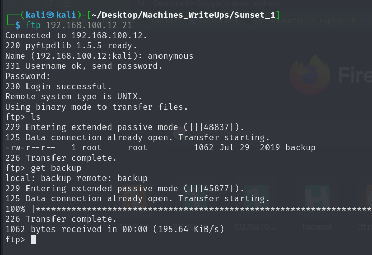
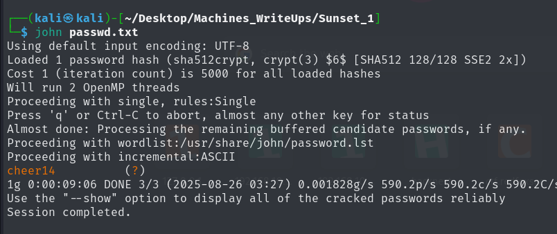

# Sunset Writeup

### Getting the target machine IP address, I used arp-scan in local network

> target ip: 192.168.100.12

## Network Scanning and Exploitation

```bash

┌──(kali㉿kali)-[~/Desktop/Machines_WriteUps/Sunset_1]
└─$ nmap -sV 192.168.100.12 -o nmap_full_scan
Starting Nmap 7.95 ( https://nmap.org ) at 2025-08-26 02:27 EDT
Nmap scan report for 192.168.100.12
Host is up (0.00067s latency).
Not shown: 998 closed tcp ports (reset)
PORT   STATE SERVICE VERSION
21/tcp open  ftp     pyftpdlib 1.5.5
22/tcp open  ssh     OpenSSH 7.9p1 Debian 10 (protocol 2.0)
MAC Address: 08:00:27:64:18:24 (PCS Systemtechnik/Oracle VirtualBox virtual NIC)
Service Info: OS: Linux; CPE: cpe:/o:linux:linux_kernel

Service detection performed. Please report any incorrect results at https://nmap.org/submit/ .
Nmap done: 1 IP address (1 host up) scanned in 1.68 seconds

```


As ftp port is open I used ftp to connect it on port 21 using anonymous credentials and got connected



It has filed backup and I transferred it to my machine using get command

Here are contents of backup file:

```bash

┌──(kali㉿kali)-[~/Desktop/Machines_WriteUps/Sunset_1]
└─$ cat backup
CREDENTIALS:                                                                                                                                                                                                       
office:$6$$9ZYTy.VI0M7cG9tVcPl.QZZi2XHOUZ9hLsiCr/avWTajSPHqws7.75I9ZjP4HwLN3Gvio5To4gjBdeDGzhq.X.                                                                                                                  
datacenter:$6$$3QW/J4OlV3naFDbhuksxRXLrkR6iKo4gh.Zx1RfZC2OINKMiJ/6Ffyl33OFtBvCI7S4N1b8vlDylF2hG2N0NN/                                                                                                              
sky:$6$$Ny8IwgIPYq5pHGZqyIXmoVRRmWydH7u2JbaTo.H2kNG7hFtR.pZb94.HjeTK1MLyBxw8PUeyzJszcwfH0qepG0                                                                                                                     
sunset:$6$406THujdibTNu./R$NzquK0QRsbAUUSrHcpR2QrrlU3fA/SJo7sPDPbP3xcCR/lpbgMXS67Y27KtgLZAcJq9KZpEKEqBHFLzFSZ9bo/
space:$6$$4NccGQWPfiyfGKHgyhJBgiadOlP/FM4.Qwl1yIWP28ABx.YuOsiRaiKKU.4A1HKs9XLXtq8qFuC3W6SCE4Ltx/   

```

It seems to be username:password pair with hashed password.

### I will be using john to crack the hash of the password for user sunset as machine's name is giving hint to this user



Here we got the password for the user sunset


